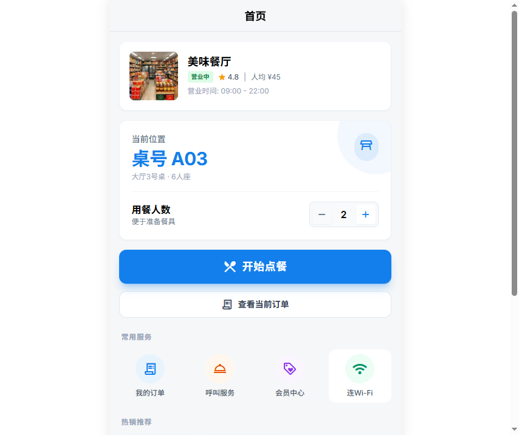
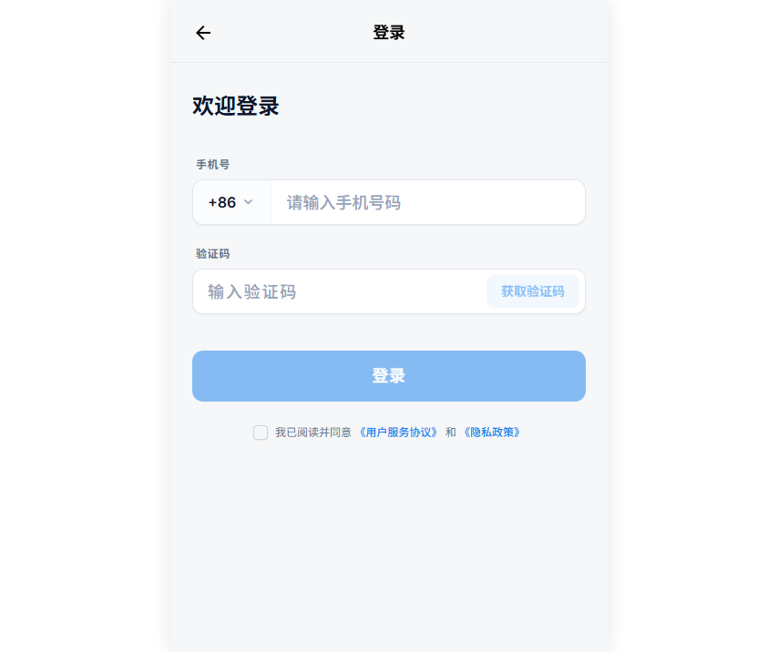
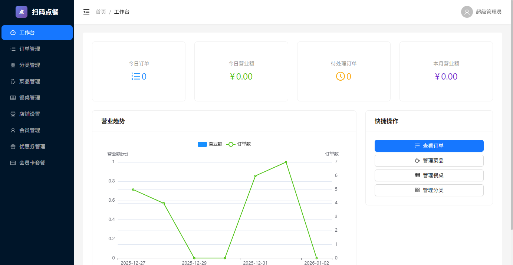
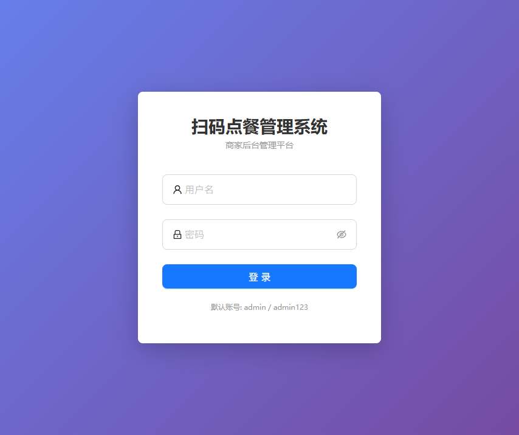
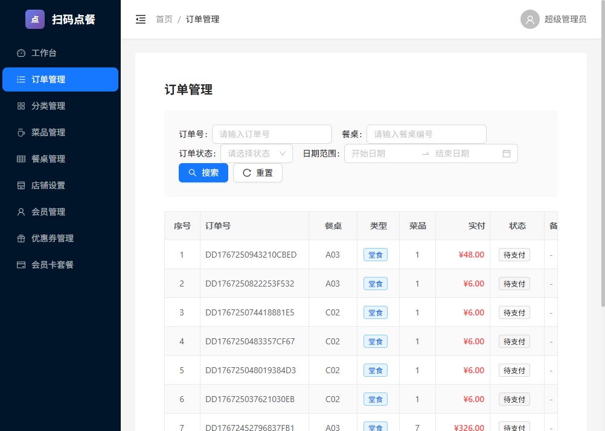
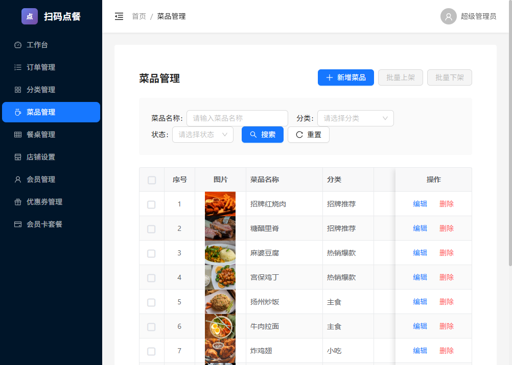
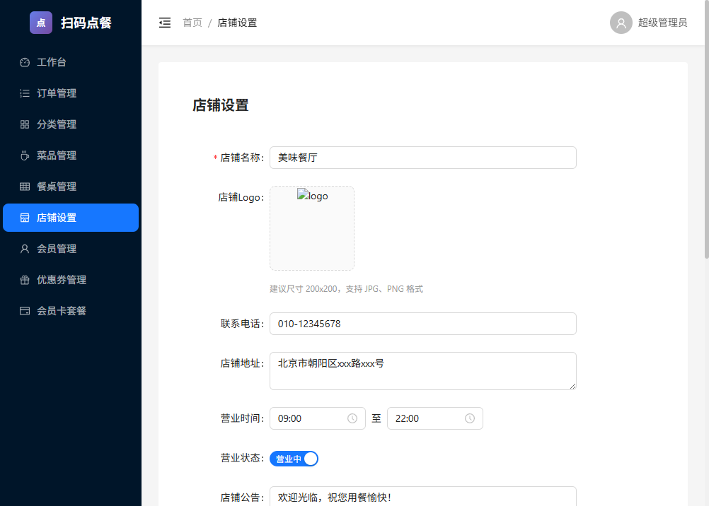

# 🍜 扫码点餐系统 | ScanToOrder

<div align="center">

[](https://github.com/daipingfa/ScanToOrder)
[](https://gitee.com/dai_ping_fa/ScanToOrder)


**一款现代化的餐饮扫码点餐解决方案，支持微信/支付宝扫码、多种支付方式、会员管理等功能**

🌐 **在线演示**：[https://gumo-admin.top](https://gumo-admin.top)

[📖 快速开始](#-快速部署) · [🎯 功能特性](#-功能特性) · [📸 系统截图](#-系统截图) · [💬 联系我们](#-联系我们)

</div>

---

## 🌐 在线演示

| 入口 | 地址 | 说明 |
|------|------|------|
| 🍽️ 顾客端 | [https://gumo-admin.top](https://gumo-admin.top) | 扫码或直接访问体验点餐 |
| 💼 管理端 | [https://gumo-admin.top/admin](https://gumo-admin.top/admin) | 账号：`admin` 密码：`admin123` |

---

## ✨ 项目简介

扫码点餐系统是一套完整的餐饮行业数字化解决方案，采用前后端分离架构，支持 Docker 一键部署。系统包含：

- 📱 **顾客端**：扫码点餐、会员中心、订单追踪
- 💼 **商家管理端**：订单管理、菜品管理、数据统计
- ⚙️ **后端服务**：RESTful API、WebSocket 实时通知

## 🎯 功能特性

### 🛒 点餐功能
- ✅ 扫码进入点餐页面
- ✅ 菜品分类浏览与搜索
- ✅ 购物车管理
- ✅ 多规格菜品选择
- ✅ 特殊要求备注

### 💳 支付功能
- ✅ 微信支付（H5/Native）
- ✅ 支付宝支付
- ✅ 聚合支付（嘉联）
- ✅ 支付方式后台可控
- ✅ 自动识别扫码环境（微信环境只显示微信支付）

### 👤 会员系统
- ✅ 手机号登录（短信验证码）
- ✅ 会员卡购买
- ✅ 优惠券系统
- ✅ 积分体系

### 📊 商家管理
- ✅ 实时订单通知（WebSocket）
- ✅ 订单状态管理（待处理/制作中/已完成）
- ✅ 菜品分类管理
- ✅ 桌台二维码生成
- ✅ 营业数据统计
- ✅ 店铺信息配置

### 🔒 系统特性
- ✅ Docker 一键部署
- ✅ 离线包部署支持
- ✅ 授权机制保护
- ✅ 数据安全加密

## 🛠️ 技术栈

| 模块 | 技术 |
|------|------|
| 后端 | Spring Boot 3.2 + MyBatis-Plus + MySQL 8 + Redis 7 |
| 顾客端 | Vue 3 + TypeScript + Tailwind CSS + Vite |
| 管理端 | Vue 3 + TypeScript + Ant Design Vue 4 |
| 容器化 | Docker + Docker Compose + Nginx |
| 支付 | 微信支付 + 支付宝 + 嘉联聚合支付 |
| 短信 | 阿里云短信服务 |

## 📸 系统截图

### 📱 顾客端（手机端）

<table>
  <tr>
    <td align="center"><b>首页</b></td>
    <td align="center"><b>点餐</b></td>
    <td align="center"><b>会员中心</b></td>
    <td align="center"><b>登录</b></td>
  </tr>
  <tr>
    <td></td>
    <td></td>
    <td></td>
    <td></td>
  </tr>
</table>

### 💼 管理端（PC端）

<table>
  <tr>
    <td align="center"><b>工作台</b></td>
    <td align="center"><b>登录页面</b></td>
  </tr>
  <tr>
    <td></td>
    <td></td>
  </tr>
  <tr>
    <td align="center"><b>订单管理</b></td>
    <td align="center"><b>菜品管理</b></td>
  </tr>
  <tr>
    <td></td>
    <td></td>
  </tr>
  <tr>
    <td align="center"><b>店铺设置</b></td>
    <td></td>
  </tr>
  <tr>
    <td></td>
    <td></td>
  </tr>
</table>

## 🚀 快速部署

### 下载离线部署包

从 [Releases](https://scantoorder.oss-cn-beijing.aliyuncs.com/offline-package.zip) 下载最新版本的 `offline-package.zip`

### 部署步骤

#### 1️⃣ 上传到服务器

```bash
# 上传 zip 包到服务器
scp offline-package.zip root@your-server:/opt/

# 登录服务器
ssh root@your-server
cd /opt
unzip offline-package.zip
cd offline-package
```

#### 2️⃣ 导入 Docker 镜像

```bash
# Linux/Mac
chmod +x import.sh
./import.sh

# Windows (PowerShell)
.\import.bat
```

#### 3️⃣ 配置环境变量

```bash
cp .env.example .env
vim .env
```

**必须配置的项目：**

```env
# 🌐 应用域名（重要！支付回调需要）
APP_DOMAIN=https://your-domain.com

# 🔐 安全配置（请修改为强密码）
MYSQL_ROOT_PASSWORD=YourSecurePassword123
MYSQL_PASSWORD=YourSecurePassword123
REDIS_PASSWORD=YourSecurePassword123
JWT_SECRET=your-super-secret-jwt-key-at-least-32-characters

# 📱 阿里云短信（可选，用于手机登录）
ALIYUN_SMS_ACCESS_KEY=your_access_key
ALIYUN_SMS_SECRET_KEY=your_secret_key
ALIYUN_SMS_SIGN_NAME=your_sign_name
ALIYUN_SMS_TEMPLATE_CODE=SMS_XXXXXXXX
```

#### 4️⃣ 启动系统

```bash
docker compose up -d
```

#### 5️⃣ 访问系统

| 地址 | 说明 |
|------|------|
| `http://your-domain.com` | 顾客扫码点餐 |
| `http://your-domain.com/admin` | 商家管理后台 |
| `http://your-domain.com/api/doc.html` | API 接口文档 |

**默认管理员账号：** `admin` / `admin123`

## 🔐 授权激活

系统采用授权机制保护，部署后需要激活：

1. 访问管理后台，查看"系统未授权"页面
2. 页面显示服务器 IP 地址
3. **联系开发者获取授权文件**
4. 上传 `.lic` 授权文件完成激活

## 📁 部署包结构

```
offline-package/
├── images/              # Docker 镜像文件
│   ├── mysql.tar
│   ├── redis.tar
│   ├── backend.tar
│   ├── admin.tar
│   ├── mobile.tar
│   └── nginx.tar
├── nginx/               # Nginx 配置
├── license/             # 授权文件目录
├── logs/                # 日志目录
├── docker-compose.yml   # 编排配置
├── .env.example         # 环境变量模板
├── import.sh            # Linux 导入脚本
└── import.bat           # Windows 导入脚本
```

## 🛠️ 常用运维命令

```bash
# 查看服务状态
docker compose ps

# 查看日志
docker compose logs -f backend

# 重启服务
docker compose restart backend

# 停止所有服务
docker compose down

# 启动所有服务
docker compose up -d

# 进入 MySQL
docker exec -it order-mysql mysql -uroot -p

# 备份数据库
docker exec order-mysql mysqldump -uroot -p order_system > backup.sql
```

## 💰 授权价格

| 版本 | 价格 | 说明 |
|------|------|------|
| 单店版 | ¥299 | 单个域名/IP 授权 |
| 多店版 | ¥599 | 最多 5 个域名/IP |
| 不限版 | ¥999 | 不限制域名/IP |
| 源码版 | 面议 | 包含完整源代码 |

> 所有版本均包含一年技术支持

## 💬 联系我们

<table>
  <tr>
    <td align="center">
      <b>QQ</b><br>
      1612423062
    </td>
    <td align="center">
      <b>GitHub</b><br>
      <a href="https://github.com/daipingfa/ScanToOrder/issues">Issues</a>
    </td>
    <td align="center">
      <b>Gitee</b><br>
      <a href="https://gitee.com/dai_ping_fa/ScanToOrder/issues">Issues</a>
    </td>
  </tr>
</table>

## 📝 更新日志

### v1.2.0 (2025-01)
- ✨ 新增会员卡系统
- ✨ 新增优惠券功能
- ✨ 支付方式后台可控
- ✨ 自动识别微信/支付宝环境
- ✨ 支持嘉联聚合支付
- 🐛 修复支付回调问题
- 🐛 优化订单流程

### v1.1.0 (2024-12)
- ✨ 新增多种支付方式
- ✨ 新增 WebSocket 实时通知
- ✨ 优化 Docker 部署流程

### v1.0.0 (2024-11)
- 🎉 首次发布

## ⭐ 支持项目

如果这个项目对你有帮助，请给一个 **Star** ⭐ 支持一下！

---

<div align="center">

**扫码点餐系统** © 2024-2025

让餐饮服务更智能 🍜

</div>

